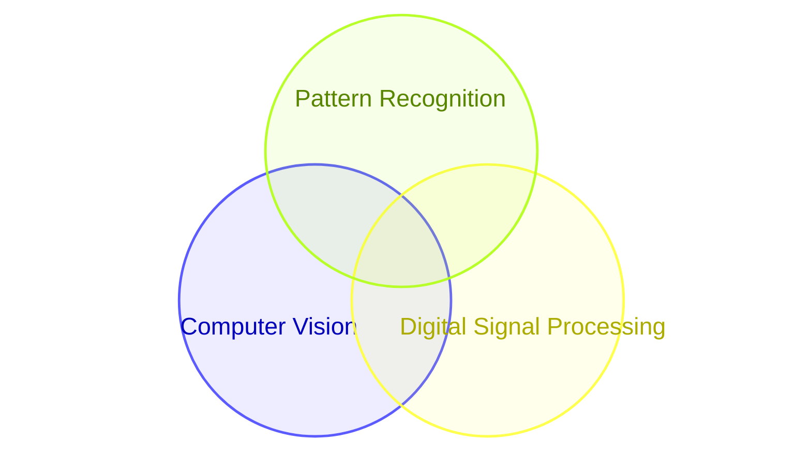
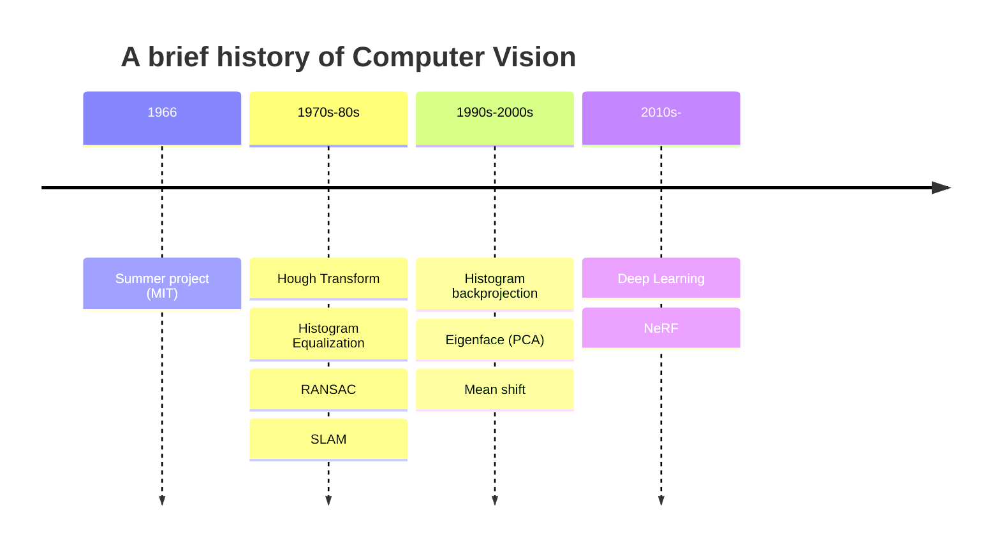
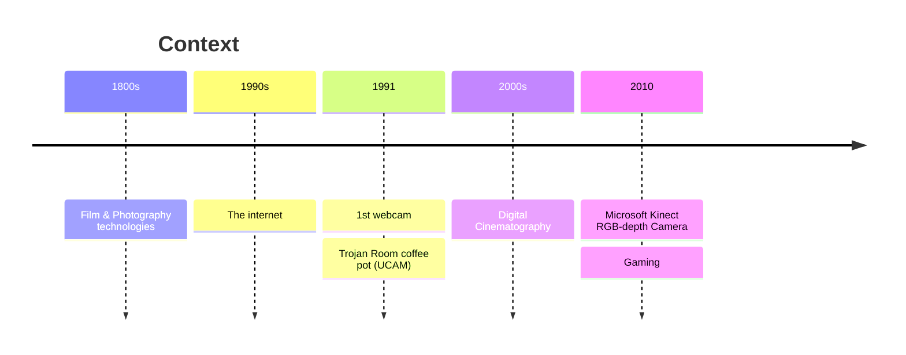

##   Introduction to Computer Vision

Reading:  Computer Vision: Algorithms and Applications, by  [Szeliski,  Chp 1](https://szeliski.org/Book/)

## What do you see? How do you see?

> *"The misperception that vision should be easy dates back to the early days of artificial intelligence"* [Szeliski,  Chp 1](https://szeliski.org/Book/)

- [Akiyoshi's illusion pages](https://www.ritsumei.ac.jp/%7Eakitaoka/index-e.html)

## What is Computer Vision ?

> *"What distinguished **computer vision** from the already existing field of **digital image processing** was a desire to recover the three-dimensional structure of the world from images and to use this as a stepping stone towards full scene understanding."* [Szeliski,  Chp 1](https://szeliski.org/Book/)

##  A brief history of Computer Vision

> *"When computer vision first started out in the early 1970s, it was viewed as the visual perception component of an ambitious agenda to mimic human intelligence and to endow robots with intelligent behavior."*

- [MIT Summer Project (Papert, 1966)](https://doi.org/10.1037/h0042519)
- [Hough Transform](https://en.wikipedia.org/wiki/Hough_transform)
- [RANSAC](https://en.wikipedia.org/wiki/Random_sample_consensus)
- [Histogram Equalization](https://en.wikipedia.org/wiki/Histogram_equalization)
- [Eigenface](https://en.wikipedia.org/wiki/Eigenface)
- [Mean shift](https://en.wikipedia.org/wiki/Mean_shift)
- [SLAM](https://en.wikipedia.org/wiki/Simultaneous_localization_and_mapping)
- [NeRF](https://en.wikipedia.org/wiki/Neural_radiance_field)

## Context

- [History of film technology](https://en.wikipedia.org/wiki/History_of_film_technology) and [history of photography](https://en.wikipedia.org/wiki/History_of_photography)
- [Trojan Room coffee pot (1991)](https://en.wikipedia.org/wiki/Trojan_Room_coffee_pot)
- [Digital Cinematography](https://en.wikipedia.org/wiki/Digital_cinematography)

## Applications

- Film special effects e.g.  [Bullet time](https://en.wikipedia.org/wiki/Bullet_time#Technology)  using  multiple cameras

    - [The Matrix Visual effects (1999)](https://en.wikipedia.org/wiki/The_Matrix#Visual_effects) with [Video](https://en.wikipedia.org/wiki/File:The_Matrix_Bullet_Time_Effect.ogv)

- robotics e.g. [SLAM](https://en.wikipedia.org/wiki/Simultaneous_localization_and_mapping)

- virtual reality/augmented reality/mixed reality e.g. [NeRF](https://en.wikipedia.org/wiki/Neural_radiance_field)

- medical imaging

- remote sensing

- surveillance, biometrics, industrical inspection 

- [David Lowe’s website of industrial vision applications](https://www.cs.ubc.ca/~lowe/vision.html)

## Computer Vision Research

Top venues for publications in Computer Vision (source: [Top 100 publications (Google Scholar)](https://scholar.google.com/citations?view_op=top_venues&hl=en)):

- #2	IEEE/CVF Conference on Computer Vision and Pattern Recognition (CVPR)
- #22	European Conference on Computer Vision (ECCV)
- #25	IEEE/CVF International Conference on Computer Vision (ICCV)
- #46	IEEE Transactions on Pattern Analysis and Machine Intelligence (PAMI)

## Computer Vision: Why is it so difficult?

> *"In part, it is because it is an **inverse problem**, in which we seek to recover some unknowns given insufficient information to fully specify the solution. We must therefore resort to physics-based and probabilistic models, or machine learning from large sets of examples, to disambiguate between potential solutions."* [Szeliski,  Chp 1](https://szeliski.org/Book/)

