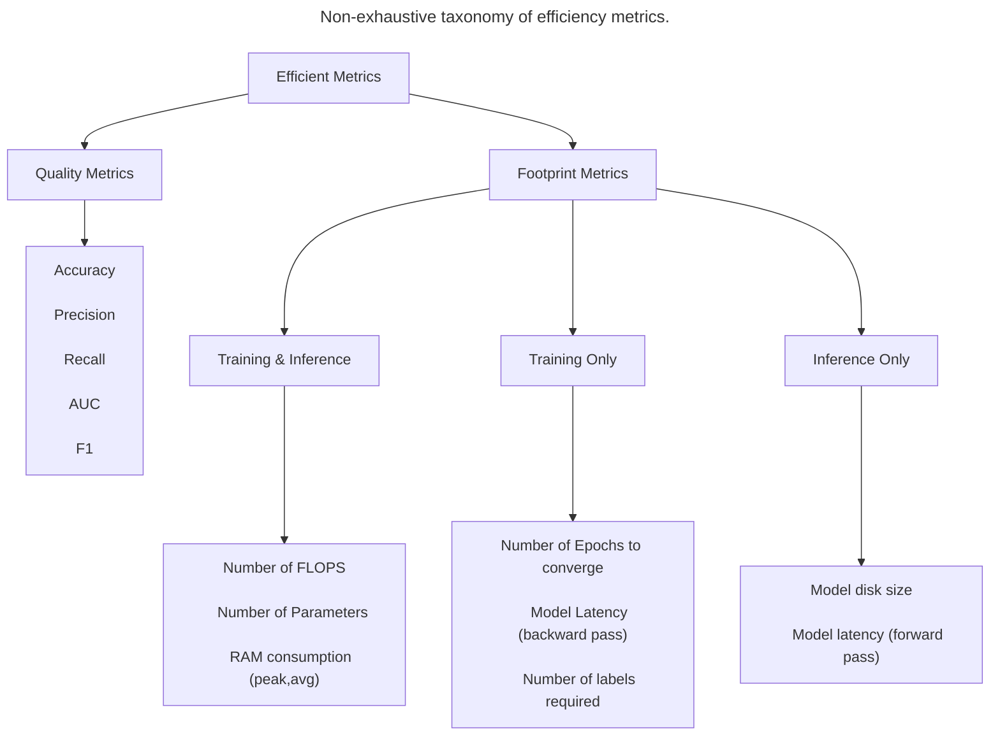

#  Non-exhaustive taxonomy of efficiency metrics

> *"To deploy a model, typically we can measure its feasibility via its performance (quality metrics like accuracy, precision, and recall) and cost (footprint metrics like model size, latency, and number of epochs to convergence). To compare any two given models for their relative efficiency, it is essential to compare both quality and footprint metrics."* [DOI:10.1145/3578938](https://dl.acm.org/doi/10.1145/3578938)

